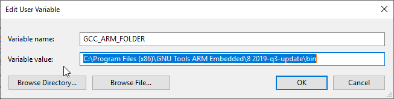
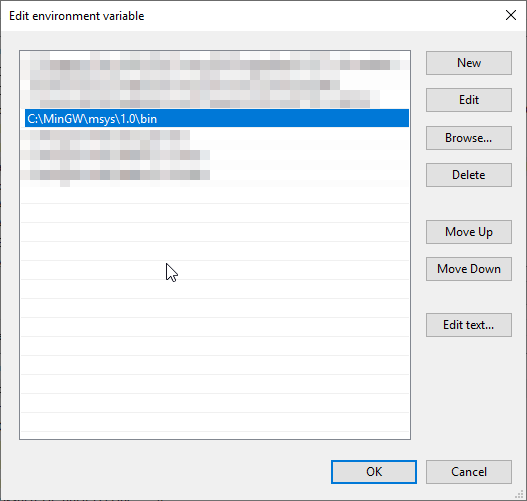
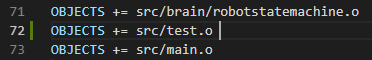

Tools for development 
======================

The low level control application, which runs on the Nucleo-F401RE, is implemented in C/C++ language 
by using `mbed 5` library. The project structure is simple, it contains fife (5) basic folder:
doc, include, libs, src and BUILD. The 'BUILD' folder includes the built binary files, which need
to program the micro-controller. The 'libs' incorporates external libraries, like `mbed` and `rtos`. The features and 
other scripts are realized in the 'include' and 'src' folder. while the doc includes the html documentation. 
We used Visual Studio Code for developing. 

Building
---------

After you modified any part of the components you have to rebuild the application before flashing the micro-controller.
For building you will need to install some other software on your pc. 

**Windows setup**

Firstly you need a cross-compiler, you can find it on the 
official site of Arm Developer. Here is a `link <https://developer.arm.com/tools-and-software/open-source-software/developer-tools/gnu-toolchain/gnu-rm/downloads>`_ .
If you installed the Gnu Embedded Toolchain for Arm, you need to add a new environment variable with 'GCC_ARM_FOLDER' name,
which value is the compiler folder. You can see an example on the following picture. 

Other application necessary for easy building is MSYS2 and to add the location of installation folder to the 'Path' environment variable. 

If you set correctly the environment variable, then the 'make' command is recognized in command prompt and you can build your application. 

**Linux setup**

The GNU Core utilities are already installed on linux, so only the setup for Gnu Embedded Toolchain for Arm is required, which means you will have to download
a linux version from this `link <https://developer.arm.com/tools-and-software/open-source-software/developer-tools/gnu-toolchain/gnu-rm/downloads>`_  
and decompress it on your pc. After decompressing, you need to set the 'GCC_ARM_FOLDER' environment variable with the location where you decompressed
the cross-compiler. Therefore the 'make' utility knows the location of cross-compiler. To add the persistent environment variable you will need to 
introduce a code in terminal similar to the following:

"echo "export GCC_ARM_FOLDER=/home/user/Workspace/Crosscompilers/gcc-arm-none-eabi-8-2019-q3-update/bin" >> ~/.bashrc"

The variable is accessible for only your user and you have to restart the terminal for it to be valid. 

**Building**

After the setup you have to change the location in terminal to main project folder and you can run the 'make' script, will build
automatically the project in the 'BUILD' folder.

If everything went well, then a new binary file 
with name 'Nucleo_mbedrobot.bin' appeared in the 'BUILD' folder. Success compilation terminates with following message:

'===== bin file ready to flash: BUILD/Nucleo_mbedrobot.bin ====='. 

Flashing 
--------

The nucleo board has to main parts: the programmer/debugger and the micro-controller. The programmer has the mini-usb connector and a 
tricolor LED. The micro-controller has the connectors, reset and user button, power and built-in led, etc. The micro-controller can be powered by 
external source (USB) or by a power supply (wires), while the debugger can be powered on only by the USB. The jumper JP5 near the reset 
button controllers the power source for the micr-controller (E5V - via external or U5V - via usb). 

Before you flash, you have to connect the programmer and make sure the micro-controller is powered on. This is indicated by the power LED (LD3).
You can simply copy the binary file (*.bin) on the micro-controller to flash it or you can apply the 'flash_win.bat' script, present in the project 
directory (it does the same action). If you use the flash_win, check that the programmer mounted partition identification letter is the same one 
mentioned in script. If they don't match, you can update in the script with the right new one (like D:, F:, C:). 

New component
-------------

When you want to implement some new feature, it's recommended to keep clean the project structure. For this reason, you need to create the header 
files in the 'include' directory and the source file in the 'src' folder. You can do this by appling the 'newComponent.py' script, which creates 
automatically the include file and the source file. There are some optional parameters: you can check them by using '-help' parameter. 

python newComponent.py --help

The script creates two includes files: 'test.hpp' and 'test.inl'. in the 'include' folder and a source file ('test.cpp') in the 'src' folder. 

python newComponent.py -c test

If you want to compile these new components, then you must add them to the makefile like new objects. You can see on the figure below, where new 
object is defined in the 72nd line:

Now you can compile your application with the new components by building the project ('make' command). You have to see the added component 
between the listed source files, like on the figure below:

.. image:: pics/others/compiling_message.png
    :align: center
    :scale: 75%

Notes
------

The script for creating a new component (newComponent.py) and for flashing the micro-controller weren't projected to linux usage, so we cannot guarantee the 
correct working of them. 

If the Nucleo board is communicated with the RPI via our given python startup package, you will have to set the boudrate on the nucleo to 256000. 
If the Nucleo board is communicated with the RPI via our given c++ startup package, you will have to set the boudrate on the nucleo to 230400. 