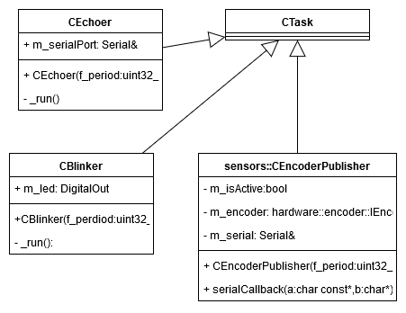

Examples namespace
==================

The 'examples' namespace aims to present some example of usage other package, like Task. It includes 
three examples, a blinker, an echoer and a encoder publisher. The blinker example has functionality to 
toggle a built-in led based on a Task. Similarly the echoer example sends periodically a simple message to 
the other device. The encoder publisher designs to send the measured rotary speed of motor to the other device
through serial port. 

.. doxygenclass::  examples::CBlinker
   :project: myproject
   :members: 
   :undoc-members:
   :private-members:

.. doxygenclass::  examples::CEchoer
   :project: myproject
   :members: 
   :undoc-members:
   :private-members:

.. doxygenclass::  examples::sensors::CEncoderPublisher
   :project: myproject
   :members: 
   :undoc-members:
   :private-members:

