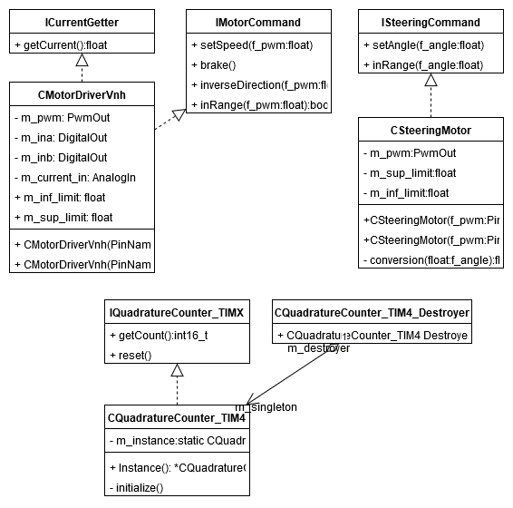
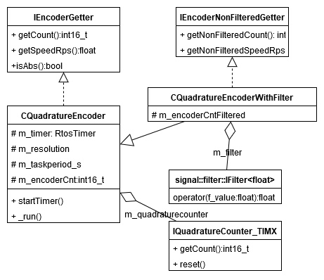

Hardware package
================

The hardware namespace has two parts: drivers and encoder. The drivers control the actuators and provides an interface with the low level functionality 
of the sensors, while the 'encoder' implements the rotary speed encoder, while the lower level pulse counter is described in the 'drivers' namespace. 

Drivers namespace
------------------

Two different drivers are realized: dc motor driver and servo motor driver. 
The dc motor driver has a limit in 0.5 PWM, respectively 0.5 m/s.
The steering driver has a limit in -23.0 and 23.0 rotation degrees. 

.. doxygenclass:: hardware::drivers::IMotorCommand
   :project: myproject
   :members:
   :undoc-members:

.. doxygenclass:: hardware::drivers::CMotorDriverVnh
   :project: myproject
   :members:
   :private-members:

.. doxygenclass:: hardware::drivers::ISteeringCommand
   :project: myproject
   :members:
   :undoc-members:

.. doxygenclass:: hardware::drivers::CSteeringMotor
   :project: myproject
   :members:
   :private-members:
   

Encoder namespace
------------------

In the 'encoder' namespace, the rotary speed encoder functionalities are implemented. 
It contains two interfaces to access filtered and non-filtered values
and two classes with encoder services. 

.. doxygenclass::  hardware::encoders::IEncoderGetter
   :project: myproject
   :members:
   :undoc-members:

.. doxygenclass:: hardware::encoders::CQuadratureEncoder
   :project: myproject
   :members:
   :protected-members:
   :private-members:
   :undoc-members:

.. doxygenclass::  hardware::encoders::IEncoderNonFilteredGetter
   :project: myproject
   :members:
   :undoc-members:

.. doxygenclass:: hardware::encoders::CQuadratureEncoderWithFilter
   :project: myproject
   :members:
   :protected-members:
   :private-members:
   :undoc-members:

.. doxygenclass:: hardware::encoders::IQuadratureCounter_TIMX
   :project: myproject
   :members:
   :undoc-members:

.. doxygenclass:: hardware::encoders::CQuadratureCounter_TIM4
   :project: myproject
   :members:

.. doxygenclass:: hardware::encoders::CQuadratureCounter_TIM4::CQuadratureCounter_TIM4_Destroyer
   :project: myproject
   :members:
