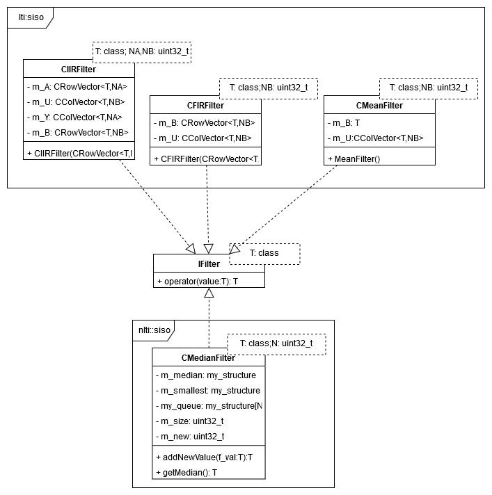
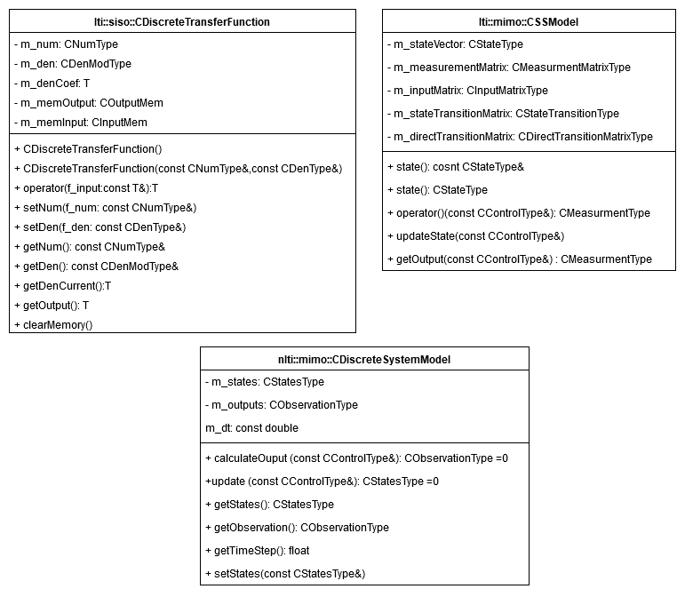
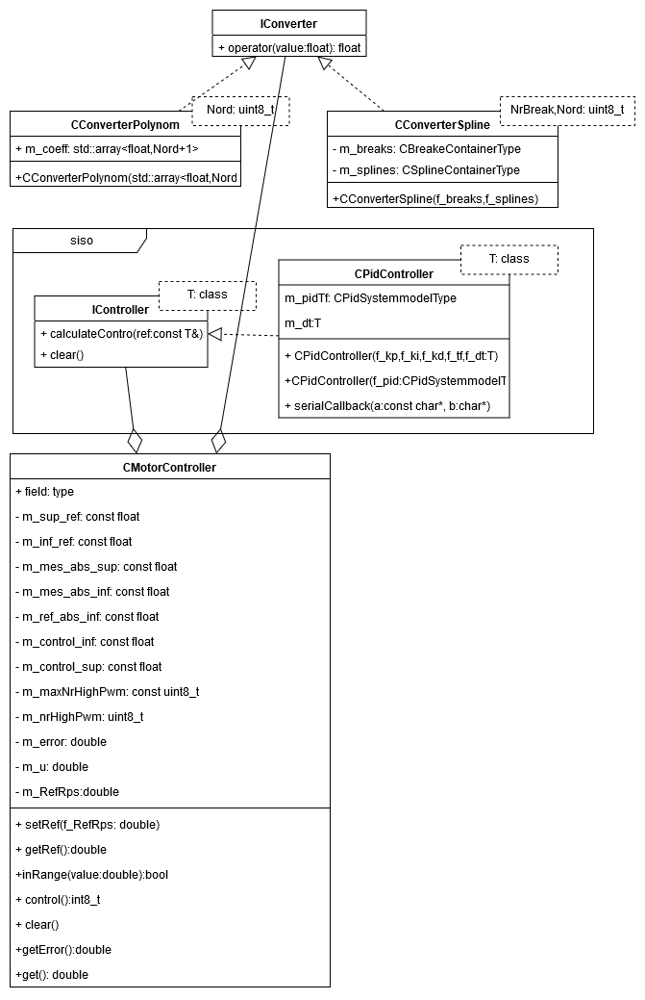

Signal namespace
================

The 'signal' namespace includes some package to process the signals, like transfer functions, filters and controller. 
It has three sub-namespaces: filters, system models and controllers. 

Filter namespace
-----------------

The 'filter' namespace implements the filters' functionalities. 
There are four types of filters implemented: mean filter, median filter, finite-impulse-response filter and infinite-impulse-response. 

.. doxygenclass::  signal::filter::IFilter
   :project: myproject
   :members:
   :undoc-members:

.. doxygenclass:: signal::filter::lti::siso::CMeanFilter
   :project: myproject
   :members:
   :undoc-members:

.. doxygenclass:: signal::filter::nlti::siso::CMedianFilter
   :project: myproject
   :members:
   :undoc-members:

.. doxygenclass:: signal::filter::lti::siso::CFIRFilter
   :project: myproject
   :members:
   :undoc-members:

.. doxygenclass:: signal::filter::lti::siso::CIIRFilter
   :project: myproject
   :members:
   :undoc-members:

System Models namespace
------------------------

The 'systemmodels' namespace contains some representation of systems, like transfer functions and state space models. 
These classes aim to symbolize the behavior of a system in domain of discrete time, so it can be used to implement a filter, 
a controller or other systems, for example can interpret the dc motor's behavior. 
This namespace includes three type of model: transfer function, state space model, non-linear system model. 

.. doxygenclass::  signal::systemmodels::lti::siso::CDiscreteTransferFunction
   :project: myproject
   :members:

.. doxygenclass::  signal::systemmodels::lti::mimo::CSSModel
   :project: myproject
   :members:

.. doxygenclass::  signal::systemmodels::nlti::mimo::CDiscreteTimeSystemModel
   :project: myproject
   :members:

Controllers namespace
----------------------

The 'controllers' namespace implements some control functionalities, like some converter, a siso controller and a motor-controller.
The converter aims to transform the signal from one unit measurement to another. The siso controller involves realization of a 
proportional–integral–derivative controller and an abstract interface for controllers with single input and output signal. 
The motor-controller interprets a regulator for motor's rotary speed with some safety restriction. 

.. doxygenclass::  signal::controllers::IConverter
   :project: myproject
   :members:
   :undoc-members:

.. doxygenclass::  signal::controllers::siso::IController
   :project: myproject
   :members: 
   :undoc-members:

.. doxygenclass::  signal::controllers::CMotorController
   :project: myproject
   :members: 
   :undoc-members:

.. doxygenclass::  signal::controllers::siso::CPidController
   :project: myproject
   :members: 
   :undoc-members:

.. doxygenclass::  signal::controllers::CConverterPolynom
   :project: myproject
   :members:
   :undoc-members:

.. doxygenclass::  signal::controllers::CConverterSpline
   :project: myproject
   :members: 
   :undoc-members:

