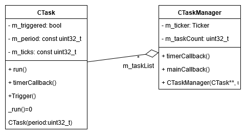

Utils namespace
===============

The 'utils' namespace includes some functionalities to manage task communication through serial. It has four package: linalg, queue, 
serial and task manager. The linalg package contains the matrix's template and operation. The queue package realizes the functionalities 
of a queue, it's a general implementation of a FIFO container (first-in-first-out). The serial package has a 'CSerialMonitor', which 
aims to interpret the received message from the serial communicatino and redirect it to the attached software component (callback function), 
in order to provide an access interface. The 'task' package realizes the managing of multiple periodical tasks by using a 'CTask' base class
and 'CTaskManager' task, where the CTaskManager applies the subclasses of 'CTask' in a predefined period. 

.. image:: pics/diagrams/pics/Class_Serial.png
    :align: center

.. doxygenclass::  utils::serial::CSerialMonitor
   :project: myproject
   :members: 
   :undoc-members:
   :private-members:

.. doxygenclass::  utils::task::CTask
   :project: myproject
   :members: 
   :undoc-members:
   :private-members:

.. doxygenclass::  utils::task::CTaskManager
   :project: myproject
   :members: 
   :undoc-members:
   :private-members:
